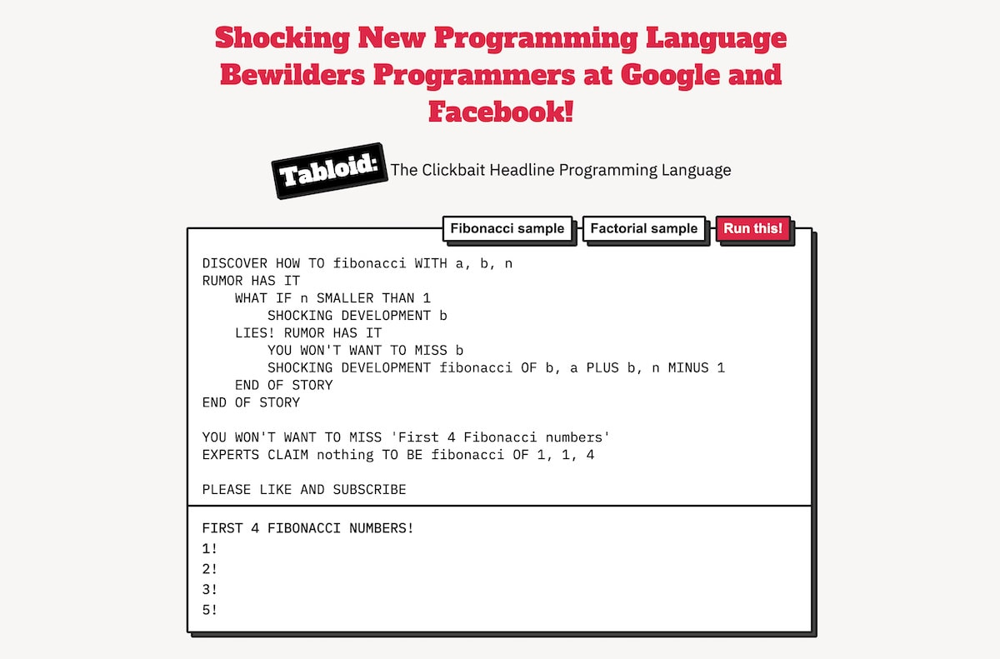

# The Tabloid Programming Language 💣

**Tabloid** is a minimal but Turing complete programming language inspired, nay, **supercharged** by clickbait headlines that rule the Internet today. You can try Tabloid [on the Tabloid website](https://tabloid.vercel.app). Thanks to [@otherjoel](https://github.com/otherjoel), there's also a [Racket implementation](https://github.com/otherjoel/tabloid) of Tabloid that's very nearly compatible. A small library of math and other helper functions is also available from [@MarcelloTheArcane](https://github.com/MarcelloTheArcane)'s [tabloid-samples](https://github.com/MarcelloTheArcane/tabloid-samples) project.



Tabloid is quite small -- it only supports number, string, and boolean values at the moment, and have semantics that match JavaScript since JavaScript is used to implement the language backend. But it's good enough for a joke language made in six hours, so I'm rollin' with it.

## Language overview

You can find the complete list of special Tabloid keywords on [the Tabloid website](https://tabloid.thesephist.vercel.app).

Tabloid has an expression-based grammar, and lacks any distinction between expressions and statements. If there isn't an explicit return from a function, the last expression's value will be returned.

Here are some primitive values in Tabloid: numbers, strings, booleans

```
100
3.141592
.718
'Hello, World!'
TOTALLY RIGHT
COMPLETELY WRONG
```

The last two -- `TOTALLY RIGHT` and `COMPLETELY WRONG` -- are how we write `true` and `false` in Tabloid.

Tabloid supports binary infix operators for arithmetic and logic.

```
(3 TIMES 5) PLUS (20 DIVIDED BY 7)
(x IS ACTUALLY 3.1415) OR COMPLETELY WRONG
```

`IS ACTUALLY` is a way to test equality, like `==` in most other languages. We can also make comparisons with `X BEATS Y` (`x > y`) and `X SMALLER THAN Y` (`x < y`).

We can initialize and assign variables in the current scope with `EXPERTS CLAIM...TO BE`, and reassign variables using `EVIDENCE SHOWS...TO BE`.

```
EXPERTS CLAIM your_mom TO BE 'big'
EVIDENCE SHOWS your_mom TO BE 'massive'
```

We can print the result of any expression with `YOU WON'T WANT TO MISS`. You won't want to miss what you're printing, and now you never will!

```
YOU WON'T WANT TO MISS 'Hello, World!'
```

Conversely, we can take (string) input from the user with `LATEST NEWS ON`. This creates a prompt to ask the user of your incredible program about the latest news.

```
EXPERTS CLAIM age TO BE
    LATEST NEWS ON 'What is your age?'
```

We define functions with `DISCOVER HOW TO functionName WITH arguments, like, this`. We can call them with the `OF` keyword.

```
DISCOVER HOW TO speak WITH message
RUMOR HAS IT
    YOU WON'T WANT TO MISS message
END OF STORY

speak OF 'Hello!'
```

Lastly, Tabloid has conditional expressions in the form of an if-else, which is written like...

```
WHAT IF condition
    doIfThing
LIES!
    doElseThing
```

We can have multi-line bodies in the `doIfThing` and `doElseThing` sections by creating a new scope, delimited by `RUMOR HAS IT` and `END OF STORY`. `LIES!` is optional.

```
WHAT IF condition RUMOR HAS IT
    do
    many
    things
END OF STORY
```

In Tabloid, newlines are not significant. If you want, you can squeeze your entire damn program in a single line of source code! How wonderful! I see exactly zero ways that could possibly go wrong.

The entire interpreter is contained in a single file, `static/js/lang.js`, and pretty straightforward. Due to the, *ahem*, unusual syntax of Tabloid, there are four layers, which includes a double-pass tokenizer that first produces a stream of word tokens (a string literal is a single word, punctuations are treated separately), and then a second tokenizer that tokenizes multi-word keywords like `DISCOVER HOW TO` (which is 3 words).

The interpreter uses a tree-walk evaluator on the syntax tree to execute a program.

## How to use

Please don't.

## Limitations

Tabloid's syntax has some (soft) limitations for now, because I had ~8 hours to finish it. Here are some of them:

- The parser doesn't know about operator precedence. To chain infix operators together like `3 PLUS 2 TIMES 10`, use parentheses, like `3 PLUS (2 TIMES 10)`.
- There isn't a built-in looping construct, like a `while` loop. This could be viewed as a feature, but is a little annoying. I left it out because it was less trivial than the other features to implement.
- There isn't very good error reporting. If there is an error during parsing or at runtime, the interpreter will currently report an error and what went wrong, but won't tell you where it messed up and will reveal interpreter implementation details.

Tabloid also doesn't have comments, because... I honestly forgot about them when I made this and only remembered like 7 hours in, and I got lazy. If this bothers you for some insane reason, feel free to make a pull request... I guess.
